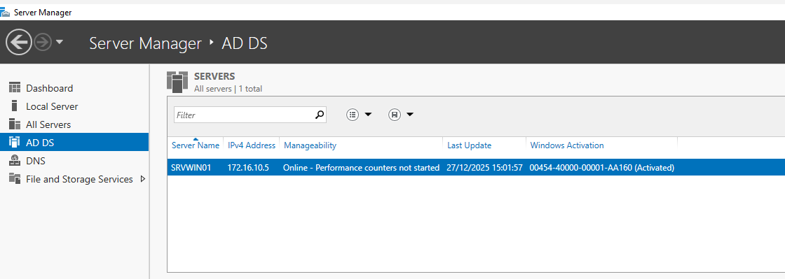
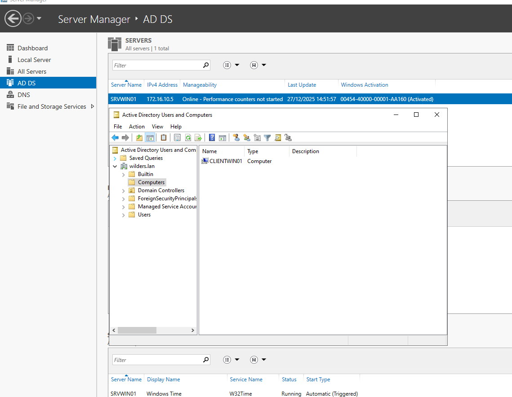

# AD_Install

### Server Manager 

La capture d’écran ci-dessous montre bien que Active Directory est installé sur le SRVWIN01 avec adresse IP fixe 172.16.10.5 :

### Active Directory Users and Computers

La capture d'écran ci dessous confirme que le pc Client CLIENTWIN01 est bien  dans le domaine wilders.lan ainsi que dans le conteneur Computers :

